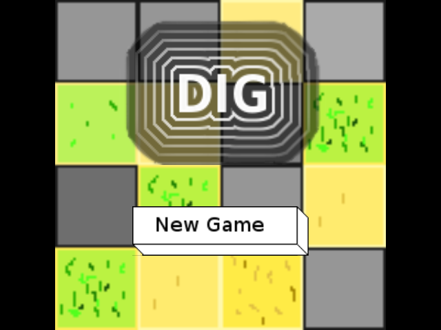
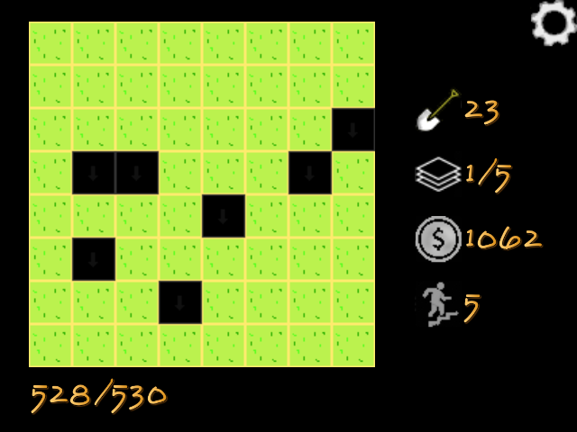

# game_dig 2.x

Dig is a game about digging in a lot of land to gain an in game currency I call pebble. When I started thinking about the differences between lateral and linear thinking, the idea for this game started to come together, and things just started moving forward from there. the first prototype started out as a simple vanilla js game (1.x), and is now my first game that makes use of the [phaser](https://phaser.io/) game framework (2.x).

<div align="center">
<a href="https://dustinpfister.github.io/game_dig">

</a>
<p>play at: <a href="https://dustinpfister.github.io/game_dig">dustinpfister.github.io</a></p>
</div>

## Some Thoughts, on ways of thought.

The whole idea of this game came to me when I started thinking about the differences between lateral, and linear thought. If you are just interested on how to understand the game mechanics you can skip over this part, as it is a kind of introduction to dig.

### Lateral thinking

The word lateral in it's adjective form, means to be of, at, toward, or from the side. However the way that I generally view lateral thinking is being multi-dimensional in your thoughts, that is thinking in all kinds of directions. Not being dogmatic to a single narrow approach, when it comes to finding a solution to a problem. Considering an array of solutions, and weighing up the pros and cons of each, and understating that each one may have a kind of value. For these reason's lateral thinking may often be considered a superior way of thinking when compared to it's counterpart know as linear (or vertical) thinking. However I would not go so far as to jump to that conclusion.

### Linear thinking (AKA Vertical thinking)

Linear is a word that means that something is arranged in or extending along a straight or nearly straight line. One way of thinking about it is picking a direction, and staying true to that single course. In many cases this way of thinking may be silly, however in some cases it makes sense, and is actually a better course of action compared to a more lateral approach. For example is it better to be a master of a single trade, or to become a jack of everything? I think most people would agree that it is preferable to become highly proficient at a single thing, than to just have superficial knowledge of a wide range of disciplines. However be it as it may, I would not jump the gun and say that this way of thinking is superior also.


## Getting started

As of this writing I am deploying the latest release of the game to the gh-pages branch of this repository as such it should be playable at [https://dustinpfister.github.io/game_dig](https://dustinpfister.github.io/game_dig). Once you go there just press "new game", and then you should be bale to jump right into it:

<div align="center">

</div>

### Bursting tiles

Each tile can have a certain amount of hit points, each tap of a tile reduces it by one. When the number of hit points reaches zero it will "burst", and any pebble that may be at that tile will be added to your winnings.

### Drop down

When a tile bursts you have the option to drop down to the layer below, or continue bursting other tiles on the present layer.

### Digs

You have a number of digs, this repentants the total number of tile hit points you can reduce. Once you run out of digs the current game will be over. You will than have the option to play again.


## Writing a hide method

Writing a "pebble hide" method as I seem to be calling it for the moment is fairly straight forward

```js
land.addHideMethod({

    name : 'all-in-left-top-zero',

    method : function () {

        console.log('I am the all-in-left-top-zero hide method');

        // set total, and amount of cell 0 to the amount of total pebble for the stack
        this.cells[0].total = this.totalPebble;
        this.cells[0].amount = this.cells[0].total;

    }

});
```

This simple example places all the stack pebble in cell 0, which should be the left, top cell in the top layer.


## Cheat Tools

There are ways of cheating by calling public methods in the JavaScript console. To make this process very easy, I have suppled a file called egg.s that contains many helpful methods for hacking the game. In chrome press Ctrl + shift + j, and make sure you have the console tab selected.

### Show where pebble is.

All tiles that have pebble will have the letter P placed over them.

```
> egg('show')
```

### westside!

West side sets the current pebble hide method to the "all-in-left-top-zero" method which is suppled with egg.js.

```
> egg('westside')
```

### get a list of hide methods
```
> land.getInfo().hideMethods
```

### find, or set the current hide method

type and enter this to find the current hide method that is being used to hide pebble
```
> land.currentHideMethod
```

Use land.getInfo to get a list of hide methods, you can set the hide method to anything listed there.

```
> land.getInfo().hideMethods
< > ["random_amount", "common_to_rare", "top_down", "top_layer"]
> land.currentHideMethod = 'random_amount'
```